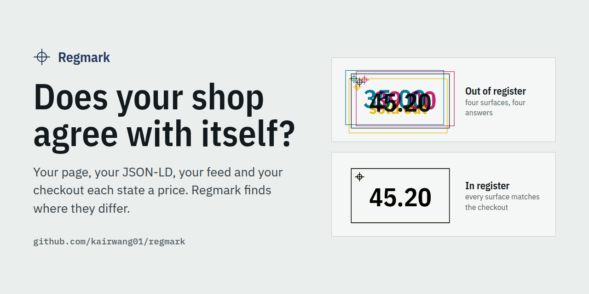
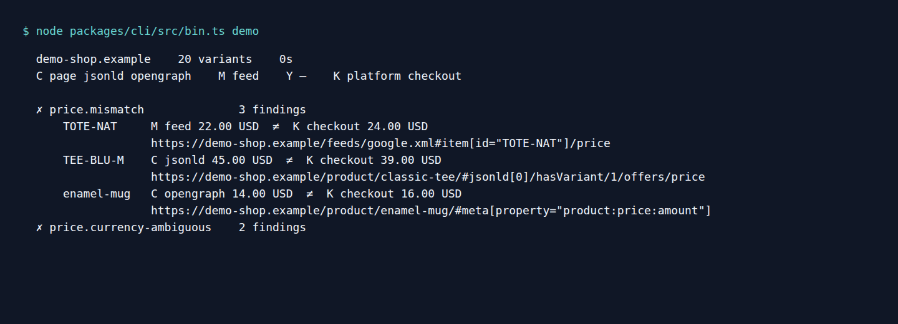
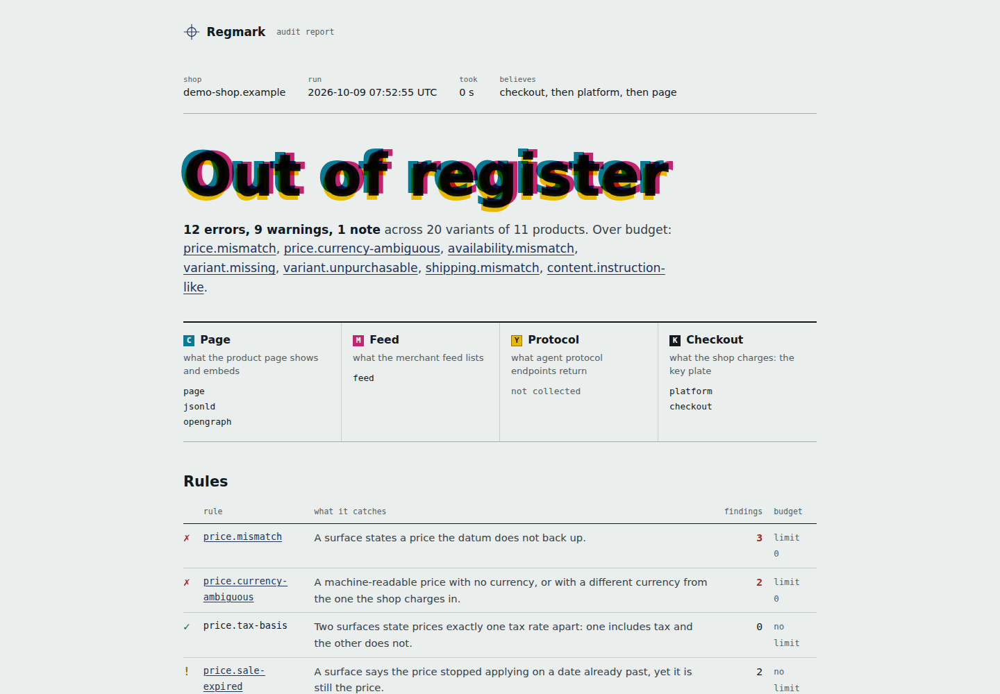
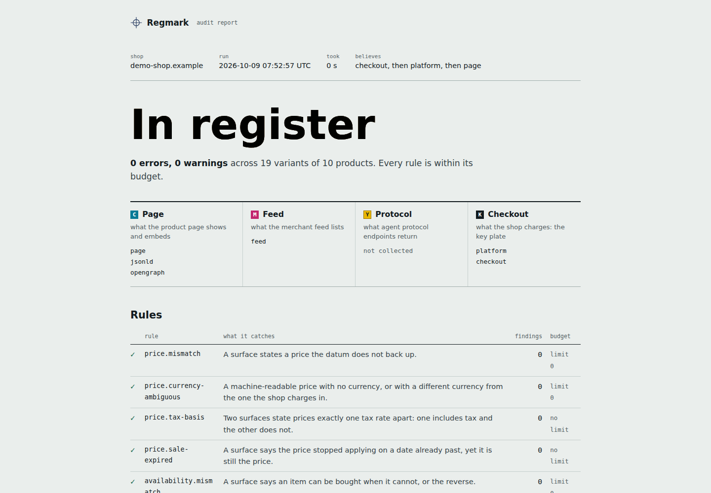
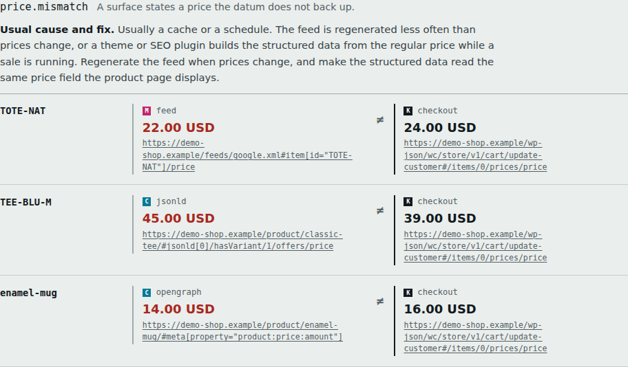

<p align="center">
  
</p>

<p align="center">
  <a href="LICENSE"></a>
  
  <a href="docs/rules.md"></a>
  <a href="README.zh-CN.md"></a>
</p>

# Regmark — ecommerce data consistency checks for CI

**Catch price, stock and shipping mismatches across product pages, JSON-LD, merchant feeds and storefront APIs.** Add verified WooCommerce cart probes to compare against checkout totals.

Your feed says **$22**. Your cart charges **$24**. Both files can be perfectly valid. Regmark connects observations for the same product variant, shows the conflicting values and their source locations, and can fail your build before a mismatch reaches your next release.

Read-only by default. No account, platform API key or hosted service required. Runs locally or in CI; exports a self-contained HTML report, JSON, SARIF, JUnit and Markdown.

[Quickstart](docs/quickstart.md) · [Configuration](docs/configuration.md) · [Rules](docs/rules.md) · [CI](docs/ci.md) · [中文](README.zh-CN.md)

## Try the demo first

Requires Node.js 22 or later and npm. This installs the CLI from GitHub and audits a bundled fixture shop:

```bash
npx --allow-git=all github:kairwang01/regmark demo
```

Open `regmark-demo.html`. The fixture contains **19 deliberately planted defects producing 22 findings**: stale feed prices, missing variants, hidden shipping charges and more. The demo exits successfully so you can explore it; a real `audit` uses the exit codes below. No live shop or credentials are needed.

<p align="center"></p>

```bash
# Compare with the same fixture without the planted defects
npx --allow-git=all github:kairwang01/regmark demo --clean --html regmark-clean.html
```

<p align="center">
  
  
</p>

A finding keeps both observed values next to their source locations:

<p align="center"></p>

The CMYK report is a printing metaphor: misaligned plates produce a blurred result. Here the plates are the product page, feed, future agent endpoints and the shop's own API or cart. Screenshots show bundled fixtures, not evidence of real merchant failures.

For a pinned release download, installation troubleshooting and source development, see the [quickstart](docs/quickstart.md).

## Run your first read-only audit

```bash
npx --allow-git=all github:kairwang01/regmark audit https://your-shop.example \
  --feed /feeds/google.xml --html report.html --json report.json
```

Use your actual store URL and feed path; omit `--feed` if you do not have one. Regmark detects WooCommerce or Shopify, samples up to 25 products, reads their pages, and compares the available observations. Requests are paced at one per second per host by default and respect `robots.txt`.

Without a checkout probe, the baseline is the storefront API where available, then the visible page. A passing report means the observed sample is within budget; check collection issues and skipped rules to understand coverage.

From here on, `regmark` means the command installed with:

```bash
npm install --global --allow-git=all github:kairwang01/regmark
regmark init https://your-shop.example
regmark audit --html report.html
regmark explain price.mismatch
```

## Where it helps

| You maintain… | Run Regmark when… | What you get |
|---|---|---|
| A WooCommerce shop or agency portfolio | A theme, price plugin or feed exporter changes | Variant-level differences with source locations for the team that owns the fix |
| Shopping feeds and technical SEO | Promotions begin or end, or stock updates drift | Repeatable checks between the feed, page and structured data |
| A Shopify storefront | A theme or structured-data app changes | Read-only public catalogue, page and feed comparisons |
| An ecommerce release pipeline | A staging deployment is ready | Reports and per-rule budgets that turn known mismatches into regression checks |

Google documents price comparisons between submitted product data, landing pages and structured data; a mismatch can result in disapproval. Regmark lets you inspect those disagreements in your own workflow. [Google Merchant Center: mismatched product price](https://support.google.com/merchants/answer/12159029).

Consistent machine-readable product facts are also useful inputs for search and shopping assistants. Regmark checks the facts it can observe; it does not measure rankings, predict AI recommendations or guarantee Merchant Center approval. [Positioning and use cases](docs/positioning.md).

## Supported surfaces and limits

| Surface | Current support | Boundary |
|---|---|---|
| Product page | Visible price/stock, JSON-LD, microdata, Open Graph and selected product text | Server-returned HTML only; no JavaScript execution or browser interaction |
| Merchant feed | Google-format RSS, Atom and TSV | Explicit `--feed` URL; a feed is read as one file |
| WooCommerce | Public Store API catalogue; optional verified cart probe | One-item cart and one destination per run; no order or payment |
| Shopify | Public `/products.json` catalogue | Read-only; no Shopify checkout probe |
| Other storefronts | Explicit pages, sitemap discovery and a supplied feed | Comparisons depend on usable facts in the returned HTML |
| UCP, ACP, MCP | Roadmap | No protocol endpoint collectors in this release |

Default comparison priority is **checkout → platform API → visible page**, per available fact. JSON-LD, microdata, Open Graph and feeds are checked against that baseline by default. All observations are bounded by the sample, source accessibility and supported extraction patterns. Catalogue discovery currently considers up to 1,000 WooCommerce or 250 Shopify products; products with more than 30 variants are excluded by default. [Exact sampling and configuration behavior](docs/configuration.md#which-products-get-audited).

## What it catches

| Rule | Default severity | Example |
|---|---|---|
| `price.mismatch` | error | Feed or structured-data price differs from the chosen baseline |
| `price.currency-ambiguous` | error | Missing or conflicting machine-readable currency |
| `price.tax-basis` | warn | Prices differ by a supported VAT/GST rate |
| `price.sale-expired` | warn | A price's stated validity period has ended |
| `availability.mismatch` | error | One surface says in stock, another says sold out |
| `variant.missing` | error | Structured data omits variants present in the catalogue |
| `variant.unpurchasable` | error | Cart refuses a variant presented as purchasable |
| `shipping.mismatch` | error | Advertised shipping conflicts with a probed cart charge |
| `shipping.undisclosed` | warn | Cart charges shipping with no observed disclosure |
| `identity.unmatched` | warn | Feed entry cannot be matched to a product the shop sells |
| `identity.gtin-invalid` | warn | Invalid GTIN checksum or duplicate variant identifier |
| `policy.return-missing` | info | No observed machine-readable return policy |
| `content.hidden-text` | warn | Selected product text is hidden by supported HTML/CSS patterns |
| `content.instruction-like` | error | Product text contains instruction-like language aimed at an assistant |
| `content.invisible-chars` | warn | Selected text contains suspicious invisible characters |

Rules have deliberate silent cases to reduce false alarms. Content checks are heuristics, not a complete prompt-injection defense. [Read the conditions and limitations of all 15 rules](docs/rules.md).

## Add it to CI

```yaml
# .github/workflows/regmark.yml
name: Regmark
on: pull_request
permissions:
  contents: read
jobs:
  audit:
    runs-on: ubuntu-latest
    steps:
      - uses: kairwang01/regmark@v0.1.0
        with:
          store: https://staging.your-shop.example
          feed: /feeds/google.xml
```

Run this after the staging deployment is ready. The action writes a job summary and uploads HTML, JSON, SARIF and Markdown reports when generated. Pin a release or commit you have reviewed; repository changes become available to release users when a new release is published.

| Exit | Meaning |
|---|---|
| `0` | Products were read and all rules are within their budgets |
| `1` | At least one rule exceeds its budget |
| `2` | Invalid configuration, execution failure, no readable products, or a collection issue in strict mode |

Error rules have a zero-finding budget by default. Warnings and informational rules are unlimited unless you set a budget. Existing findings can be adopted gradually by recording the current count per rule and reducing it as fixes land. Current source adds `--strict` to fail on any collection issue; it is not part of the pinned `v0.1.0` release. [GitHub Actions, GitLab, SARIF and budgets](docs/ci.md).

## Optional WooCommerce cart checks

On a staging shop you control:

1. Choose a token of 16–128 letters, digits, `_` or `-`.
2. Serve `regmark-verify=<token>` at `/.well-known/regmark.txt`, or publish it as a TXT record at `_regmark.<store-host>`.
3. Set `REGMARK_OWNERSHIP_TOKEN` in your environment or CI secret, then run:

```bash
regmark audit https://staging.your-shop.example --platform woocommerce \
  --feed /feeds/google.xml --checkout --ship-to US:94103 --html report.html
```

The probe adds one unit to a cart, sets a destination, reads totals and attempts cleanup after each variant. It never places an order or pays. These operations write cart/session state, and cleanup failures are reported. Ownership verification is required; inspect collection issues to confirm the probe actually ran. [Ownership and request policy](docs/configuration.md#writes).

## How it fits with other tools

| Tool or workflow | Main question it answers | How to use it with Regmark |
|---|---|---|
| Merchant Center diagnostics | Does Google report a product-data or policy issue? | Keep it as the authority on Google's processing; use Regmark for repeatable checks on your store and staging |
| Rich Results Test / schema validators | Can the page's markup be read and does it meet the tested schema requirements? | Validate markup, then compare its observed values with feed/API/cart facts |
| Feed validators | Does a feed satisfy the validator's required format and fields? | Validate feed structure, then check consistency against the store |
| Browser end-to-end tests | Does the customer journey work under scripted conditions? | Keep browser/payment coverage; add Regmark's variant matching and report formats |

These are complementary workflows. Regmark's current scope is observable product-data consistency, not complete ecommerce QA. [Why these boundaries matter](docs/positioning.md).

## Development and contributions

Regmark is an early `0.1.0` project. Its fixture benchmark checks 19 planted defects against 22 expected findings and a clean shop against zero findings. This is reproducible test evidence, not a real-world accuracy estimate.

```bash
# Source development: Node 22.18+ and the pnpm version in package.json
pnpm install --frozen-lockfile
pnpm test
pnpm bench
pnpm typecheck
```

The most valuable contribution is a small, reproducible [false alarm](https://github.com/kairwang01/regmark/issues/new?template=false-alarm.yml) or [missed defect](https://github.com/kairwang01/regmark/issues/new?template=missed-defect.yml). Theme extraction fixtures, new platform examples and documentation corrections are good entry points. [Contributing guide](CONTRIBUTING.md).

The roadmap includes protocol endpoint collectors, broader theme coverage, feed freshness and Shopify checkout support. See [project issues](https://github.com/kairwang01/regmark/issues) for current discussion. If Regmark helps your team, a star helps others discover it; a reproducible report helps make it better.

## Documentation

- [Quickstart and troubleshooting](docs/quickstart.md)
- [Reproduce screenshots and record a demo](docs/demo.md)
- [Every command, flag and config field](docs/configuration.md)
- [CI integration and adoption budgets](docs/ci.md)
- [Rule reference](docs/rules.md) and [JSON report format](docs/report-format.md)
- [Product positioning](docs/positioning.md) and [discovery, SEO and demo plan](docs/discoverability.md)
- [Contributing](CONTRIBUTING.md) and [design notes in Chinese](https://opensource.kairwang.cloud/regmark/)

## License and hosting

Apache-2.0. The project site runs on Tencent Cloud.

<a href="https://www.tencentcloud.com/"></a>

The Tencent Cloud logo is its owner's trademark and is not covered by the project license; it credits the hosting provider.
