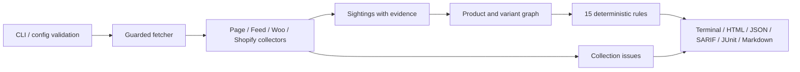

# Regmark 代码审计、定位与内容升级记录

审查日期：2026-10-09。范围：仓库内 core、四个采集器、rules、report、CLI、样板店、打包入口、GitHub Action、文档与项目元数据。审查采用代码阅读、缺陷复现、回归测试、真实本地样板店和浏览器检查；不把合成样板店结果当成真实商店准确率。

结论：现有“采集 → 观测 → 商品/规格图 → 规则 → 报告”分层值得保留。优先补强网络边界、商品身份、采集失败语义和可信报告，比扩大协议清单更能支撑用户采用。此次已落实关键修复、两项主要性能优化、可选严格模式、自动化质量检查和双语文档升级。

## 架构判断与本次重构

- **保留模块职责**：采集器不做规则判断，规则不请求网络，报告不重新推断商店事实。证据地址和原始观测值能贯穿整个流程。
- **配置校验独立**：新增 `packages/cli/src/config.ts`，在请求前检查嵌套对象、字段名、URL、布尔值和整数范围，缩短审计编排函数，避免类型断言代替运行时校验。
- **网络检查集中**：URL/IP 校验落在实际请求边界；普通请求、robots 重定向与写请求共用边界。显式 `undefined` 不再取消安全默认值。
- **单次解析与单次目录读取**：页面五种读取器共享只读 DOM；WooCommerce 的选择回调接收已取得的完整目录，抽样后只读取所选规格。
- **保留部分结果，但让 CI 可严格失败**：默认保留原有部分采集行为；`--strict` / `strict: true` 在任何 collection issue 出现时退出 2，报告 `ok: false`。

## 已复现并修复的主要问题

这里的优先级是项目维护排序，不代表公开漏洞评级。

| 优先级 | 原问题与影响 | 修复与回归证据 |
|---|---|---|
| 高 | 展开写法的 NAT64 IPv6 地址可隐藏私网 IPv4 目的地 | 规范化 IPv6 后检查嵌入 IPv4，并拒绝旧式兼容地址；`core/test/guard.test.ts` |
| 高 | robots 重定向未经过完整检查；跨 origin 重定向可能携带调用方凭据 | 在 socket 边界统一校验，拒绝 URL credentials，跨 origin 清空调用方 headers；`core/test/fetcher.test.ts` |
| 高 | JS 配置中的 `undefined` 覆盖 robots/超时/限速默认值 | 过滤未定义配置值；真实 `Disallow: /` 服务器回归验证没有读取商品页 |
| 高 | 清空购物车失败后继续下一个商品，或把返回的其他商品作为当前商品 | 清空失败停止样本；精确匹配 variant ID；`collect-woo/test/probe.test.ts` |
| 高 | `/?p=100` 和 `/?p=200` 被去掉查询串后合并，污染跨商品比较 | 保留已知商品身份参数，新增身份与图隔离测试 |
| 中 | 未知基准币种阻止金额比较；没有平台时缺少页面币种回退 | 金额比较保留，补页面币种参考；相关 price 规则回归 |
| 中 | 无数字价格的运费对象、其他国家报价被当作已披露 | 要求有可用金额或明确免费，且国家兼容；shipping 规则回归 |
| 中 | 大量不同词经 `Math.max(...values)` 导致参数栈溢出 | 遍历时累计最大值；15 万个不同词回归 |
| 中 | 普通错误文本被当作空 TSV；前导 Tab 丢失导致列错位 | 检查 id/link 表头与闭合引号，保留空首列；TSV 回归 |
| 中 | 解压错误、截断或超限时响应流清理不完整 | 使用 stream pipeline 销毁响应和解压流；异常响应回归 |
| 中 | 嵌套配置拼写/类型错误可改变安全或采集行为 | 请求前校验，拒绝未知 fetch 字段与超出 Node 定时器范围的值；配置测试确认零网络请求 |
| 中 | 空审计 JSON 可 `ok: true`，严格采集失败在 JUnit/SARIF 中缺少失败状态 | 空审计改为 false；采集错误及诊断写入各报告；collection-status 回归 |
| 中 | SARIF 以 `|` 拼接身份，可产生不同产品/规格的指纹碰撞 | 转义分隔符与转义字符，保留普通身份兼容性 |
| 低 | Action 额外参数发生 shell glob 展开 | 使用数组读取纯空白分隔参数；输入不会变成 shell 程序 |
| 低 | HTML 报告在 390px 手机宽度溢出 | 浏览器定位长规则 ID 与表格最小宽度，窄屏布局保留完整摘要与证据 |

## 性能证据

页面采集原先对同一 HTML 调用五次 DOM 解析，现在一次。本次本机微基准使用 32,761 字节合成页面，每种方法预热 4 次，每轮 12 页、共 3 轮；五个独立读取器的单页中位数为 113.40 ms，共享 DOM 为 63.26 ms，约减少 44%。脚本先验证两种调用方式的证据输出完全相同。这是当前读取器的局部对照，不是历史版本比较；网络限速、服务端延迟和购物车请求通常主导整次审计耗时，不能据此宣传“审计快 44%”。可用 `node scripts/benchmark-page.ts` 重跑，结果随硬件与系统负载变化。

WooCommerce 原先为了先抽样再获取详情而读取目录两次，现在复用第一次目录。在默认每主机请求间隔 1 秒时，每个重复目录请求的消除都能减少一次网络往返和对应等待；`cli/test/audit.test.ts` 验证目录页只请求一次。抽样规则和默认请求节奏保留。

## 质量保障与兼容性

新增 CI 在 Node 22、24 上执行冻结依赖安装、类型检查、测试、样板店验收、已提交 bundle 的一致性检查，以及独立 bundle 的正反两种 demo。该 CI 工作流的 Action 依赖固定到经核对的 commit SHA，Dependabot 配置负责后续更新。远端执行结果以 GitHub Actions 对应提交的运行记录为准；本地通过不等同于远端 CI 已通过。

本地冻结安装、类型检查、721 项测试和 6 项样板店验收均通过；缺陷样板店得到预期 22/22 条结果，对照店无发现。bundle 重建与 `--check` 一致性检查通过，390px/1440px 浏览器检查无横向溢出。依赖审计快照 `pnpm audit --json` 报告已知漏洞为 0；这仅代表当时审计源中的已知条目，不能证明所有依赖没有缺陷。

需要注意的升级行为已写入 [CHANGELOG](../CHANGELOG.md)：空审计 `ok` 修正、查询参数商品键改变、嵌套配置校验更严格。原有 `v0.1.0` 标签和下载文件没有被改写，新功能需使用本次源码/重新生成的 bundle，或后续正式发行版。

## 市场与社区建议

建议核心定位为 **“用于 CI 的电商商品数据一致性检查”**，首批服务 WooCommerce 开发者、代理商和与工程团队协作的 Feed 专家。高价值触发点是主题/插件变更、促销发布、库存同步与 Feed exporter 更新。Shopify 应明确宣传为公开目录与页面的只读检查。

差异化应通过真实证据展示：按规格关联、明确参考来源、错误值与正确值并列、可定位的证据、单文件报告、可逐步收紧的 CI 预算。UCP/ACP/MCP 支持仍是计划；不要将“AI shopping 使用场景”写成已完成的协议能力。

- [定位与用户场景](positioning.md)：核心人群、使用触发点、比较边界与待验证假设。
- [传播与 SEO/GEO 计划](discoverability.md)：17 个 Topics、搜索意图、网站元数据规格、四周内容计划与采用指标。
- [演示素材](demo.md)：实际 CLI/HTML 输出、移动端截图与 35–45 秒演示分镜。

Star 是传播反馈之一。更有价值的早期证据是陌生开发者能完成第一次审计、报告的差异被确认并修复、规则进入持续使用的 CI、出现外部贡献。当前测试数量和样板店召回不能替代这些证据。

## 后续优先级

| 阶段 | 建议 | 可验收结果 |
|---|---|---|
| 下一版发布前 | 审核本次行为变化、发布新版本、检查安装与报告兼容 | 干净安装可复现 demo；release bundle 与源码匹配 |
| 近期 | 收集经店主同意、去敏的 Woo/Shopify 真实样例，按主题和插件归档 | 每个确认缺陷或误报对应最小 fixture 与回归 |
| 近期 | 独立表达 collection status / failure reasons | 同时存在规则失败与严格采集失败时，各格式都能准确分类 |
| 中期 | 把 URL 身份解析发展成平台适配器；改进大目录覆盖说明 | 自定义 query 路由不误合并；被抽样和被排除范围可审查 |
| 中期 | 规则 fuzz/property 测试与结构化日志 | 恶意/畸形 XML、JSON-LD、货币、robots 输入不会崩溃或绕过边界 |
| 有用户证据后 | 浏览器渲染或新协议采集器 | 每项能力有真实需求、固定样例、兼容边界和维护责任 |

现存限制：静态 HTML 不执行 JavaScript；只抽取有限目录和样本；运费验证受单件商品和所选目的地限制；税差属于启发式；促销日期按当前规则的 UTC 日粒度比较；未知定制 URL 身份参数需要适配。预算比较的是数量，新缺陷替代旧缺陷而总数不增时仍可通过，因此应保留人工查看报告差异的流程。

## 交付状态

GitHub About 描述与 17 个 Topics 已通过 API 更新并读回核对。本次源码交付包含代码、文档、CI、样例、截图和匹配的 bundle；正式版本发布与推广内容发布另行进行。外部网站的 `project.json` 内容来源已更新，网站 HTML/Open Graph 等部署操作仍需沿项目现有发布流程执行。
