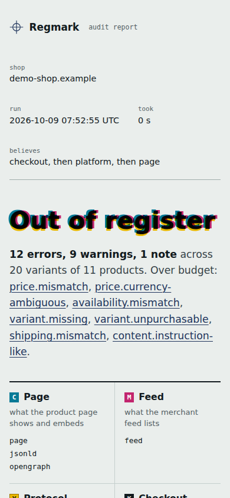

# Demo screenshots and recording recipe

The screenshots below come from Regmark's bundled fixture shop. Its 19 seeded
defects produce 22 findings. They demonstrate the tool; they are not customer
results or a measured accuracy rate on real stores.


| Clean control fixture | Report at a 390-pixel mobile viewport |
|---|---|
|  |  |

## Reproduce the screenshots

From a source checkout, install dependencies with `pnpm install --frozen-lockfile`.
Use a recent Node 22 release (22.18 or later) to run TypeScript source directly.
The standalone release bundle requires Node 22 or later.

Playwright is only needed for screenshots. Install it into a temporary directory
so the runtime CLI retains zero installation dependencies:

```bash
npm install --prefix /tmp/regmark-media playwright
/tmp/regmark-media/node_modules/.bin/playwright install chromium
node scripts/capture-demo.mjs /tmp/regmark-media/node_modules/playwright/index.mjs
```

The script runs both demos, refreshes the HTML and terminal files in `samples/`,
captures the report summary and price evidence, and checks for horizontal page
overflow at a 390-pixel viewport. It also renders the first 12 lines of actual
CLI output into a legible terminal image. This is a static rendering of the
output, not an interactive terminal capture. An existing compatible browser
can be selected with `REGMARK_CHROMIUM_PATH=/absolute/path/to/chromium`.

For a quick text-only demo:

```bash
node dist/regmark.mjs demo --html regmark-demo.html
node dist/regmark.mjs explain price.mismatch
node dist/regmark.mjs demo --clean --html regmark-clean.html
```

## A 35–45 second walkthrough

| Time | Action to record | Viewer takeaway |
|---|---|---|
| 0–7 s | Run the bundled defect demo; keep the command and summary visible | A local demo works without shop credentials |
| 7–20 s | Open the HTML report and scroll to `price.mismatch` | See the wrong value, reference value, surface and evidence locator |
| 20–28 s | Run `explain price.mismatch` | Show the usual cause and next fix |
| 28–38 s | Run the clean fixture and open its report | A clearly labelled control fixture has no findings |
| 38–45 s | Show the README's CI example and repository address | Take the next step: try a staging store or report a false alarm |

Label both fixture modes on screen. Switching fixtures is a demonstration,
not a recording of a real merchant fixing a production store. Record at
1280×800 with a readable font; export MP4/WebM for a project page and a short,
compressed GIF for social previews. Keep the static screenshots and alt text
available for readers who do not play the video. The storyboard is ready to
record; no animated recording is included in this revision.
